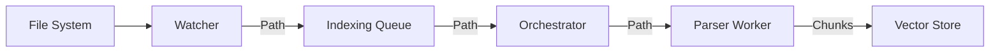

# Indexing System V2 Architecture

## Overview
The V2 Indexing System addresses the "Out of Memory" crashes and systemic inefficiencies of the V1 system. It prioritizes memory safety, backpressure management, and robust file watching.

**Status: Implemented in `electron/services/indexing/`**

## Core Principles
1.  **Memory Cap:** The system must never hold more than N MB of file content/AST in memory, regardless of the workspace size.
2.  **Pull-Based Processing:** Components pull work when they are ready, rather than having work pushed to them indefinitely.
3.  **Streaming:** Data moves through the pipeline in streams or small batches, avoiding "load everything" patterns.
4.  **Fault Tolerance:** If a worker crashes (e.g., on a bad binary file), the orchestrator restarts it without taking down the main process.

## Architecture

### 1. The Pipeline

### 2. Components

#### A. File Watcher (`WatcherService`)
*   **Location:** `electron/services/indexing/WatcherService.ts`
*   **Worker:** `electron/workers/indexing/v2-watcher-worker.ts`
*   **Role:** Monitors the filesystem for changes.
*   **Implementation:** Wraps `chokidar`.
*   **Behavior:**
    *   Debounces events (500ms).
    *   Ignores `.git`, `node_modules`.
    *   Emits atomic events: `FILE_ADDED`, `FILE_CHANGED`, `FILE_DELETED`.

#### B. Indexing Queue (`IndexingQueue`)
*   **Location:** `electron/services/indexing/IndexingQueue.ts`
*   **Role:** Buffers events from the watcher.
*   **Implementation:**
    *   Priority Queue (Recent edits > Initial scan).
    *   Deduplication: Updates existing entries instead of appending duplicates.

#### C. Parser Workers (`v2-parser-worker`)
*   **Location:** `electron/workers/indexing/v2-parser-worker.ts`
*   **Role:** Pure function: `Path -> Chunks[]`.
*   **Optimization:**
    *   **Strict Size Limits:** Files > 1MB are skipped (or treated as text if enabled).
    *   **Tree-Sitter:** Used for AST parsing.
    *   **Smart Chunking:** Extracts functions/classes. Truncates chunks > 8KB.

#### D. Index Orchestrator (`IndexOrchestrator`)
*   **Location:** `electron/services/indexing/IndexOrchestrator.ts`
*   **Role:** Wires it all together.
*   **Backpressure:**
    *   Manages a pool of workers (max 4).
    *   Batches upserts to `VectorService` (10 items/batch) to avoid OOM in embedding.

## Integration
To enable V2, the `IndexOrchestratorService` (V1) should be updated to delegate code indexing to `IndexOrchestrator` (V2), or V2 should be instantiated directly in `initializeServices`.
